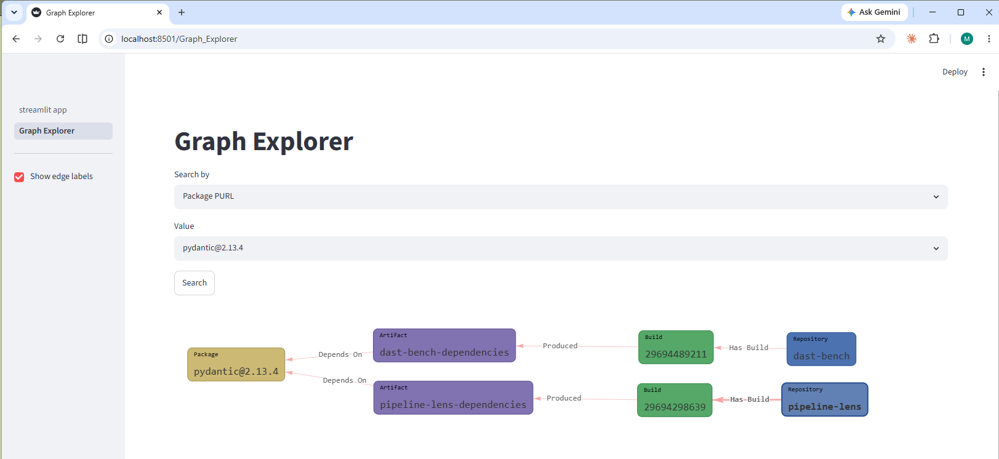

# Pipeline Lens

## The Problem

Modern software delivery is fragmented across tools that don't talk to each
other. A commit lands in GitHub, a pipeline builds and scans it, a container
gets deployed to Kubernetes — and today, answering a simple question like
"what's actually running in production, and is it safe?" means manually
checking three or four different systems with no shared context between them.

## What Pipeline Lens Does

Pipeline Lens is a working prototype that demonstrates this by correlating
events across the software delivery lifecycle into a single, queryable
`pipeline_run` record — from commit, through build and vulnerability
scanning, to what's actually deployed and running. It's a fleet-wide view
across services: a webhook-driven entry point, durable workflow
orchestration, a normalized data model new sources can be added to without
re-architecting. See [Known Limitations](#known-limitations) for where the
prototype-scale tradeoffs show.

It pulls from three genuinely different APIs (GitHub's webhooks, AWS ECR's
scan/image APIs, the Kubernetes API) into one place, which is the actual
point: making "what's deployed, and is it safe" answerable without manually
cross-referencing three systems by hand.

## Why This Architecture

- **Event-driven trigger, Temporal-managed polling downstream** — GitHub
  webhooks start the pipeline in real time. Past that entry point, the ECR
  scan wait and Kubernetes state check are Temporal activities retried on a
  declared backoff policy — `wait_for_ecr_scan_activity` explicitly raises
  until the scan status is `COMPLETE`, and Temporal's `RetryPolicy` is what
  "waits." That's polling, orchestrated declaratively instead of hand-rolled
  with a `sleep` loop, but still polling. There's no EventBridge/webhook
  wiring for scan-complete or deployment-ready; that would be the fully
  event-driven version.
- **Durable workflow state, declared retries** — a pipeline run might wait
  on a slow scan or a deployment that takes minutes. Temporal persists
  workflow progress so a worker crash or restart doesn't lose it, without
  us writing our own checkpointing. Retries themselves are still configured
  by hand per activity (`RetryPolicy(maximum_attempts=..., backoff_coefficient=...)`)
  — Temporal executes them, but someone still sets the policy.
- **One typed schema across three different source APIs** — GitHub's
  webhook JSON, ECR's `describe_image_scan_findings`/`describe_images`
  responses, and Kubernetes' Deployment/Pod objects are three different
  shapes. All three land in one `PipelineRun` model, with typed sub-models
  and enums (`VulnerabilitySeverity`, `PipelineStatus`), that the status
  logic, API, and dashboard all consume the same way — instead of every
  downstream consumer handling three raw formats itself.
- **No write path from the API to the datastore** — the FastAPI process
  never writes a `pipeline_run` record directly; every write goes through
  `write_pipeline_run_activity`, a Temporal activity the worker executes.
  The API only reads.

## Architecture

The real event flow:

```
GitHub webhook (workflow_run)
  -> FastAPI webhook endpoint
  -> RedPanda topic (repo-events)
  -> bridge (Kafka consumer -> Temporal client)
  -> Temporal workflow (PipelineRunWorkflow), run by the worker
       -> wait_for_ecr_scan_activity   (ECR vulnerability scan results)
       -> get_k8s_deployment_state_activity (live Deployment/Pod status)
       -> write_pipeline_run_activity  (persists the finished run)
  -> SQLite (shared by the API and the worker)
  -> FastAPI query endpoints (/services, /pipeline-runs, /pipeline-runs/{id}/timeline)
  -> Streamlit dashboard
```

Each service in `docker-compose.yml` maps directly onto one stage of that flow:

* `api` — FastAPI app; receives GitHub webhooks, publishes to RedPanda, and serves the read API the dashboard consumes.
* `bridge` — consumes `repo-events` from RedPanda and starts a `PipelineRunWorkflow` in Temporal for each completed `workflow_run` event.
* `worker` — the Temporal worker process; registers `PipelineRunWorkflow` and its activities and polls the task queue so workflows the bridge starts actually execute.
* `dashboard` — Streamlit fleet overview and per-service detail/timeline view.
* `redpanda`, `temporal` — the messaging and workflow-engine infrastructure; `postgres` is Temporal's own history store, not the app's data.

For demos (no live GitHub/AWS/Kubernetes needed), `scie.seed` populates the same database with a synthetic fleet (`generate_synthetic_fleet`) that exercises the identical data model and API/dashboard code paths as the real path above, just without going through RedPanda/Temporal/AWS/K8s.

## Known Limitations

Things a production version of this would need that this prototype doesn't have:

- **SQLite, one file, shared by the API and worker processes** (`docker-compose.yml`'s `scie-data` volume). Fine for a demo; not a real concurrent-write story. A production version needs Postgres — already the plan for the graph layer's ingestion ledger, see below.
- **One worker container, no horizontal scale-out.** `docker-compose.yml` runs a single `worker` replica, so there's no load story for many pipeline runs in flight at once.
- **A real gap found by reading the code, not a guess:** `bridge.py` commits its Kafka offset only after `start_workflow` succeeds, and the workflow ID is deterministic (`pipeline-run-{commit_sha}`) — so redelivery after a crash is *supposed* to be idempotent, since Temporal rejects a duplicate `start_workflow` call for an ID that's still running or already completed. But that rejection raises `WorkflowAlreadyStartedError`, and nothing in `bridge.py` catches it. A crash between the workflow starting and the offset committing crash-loops the bridge instead of recovering — capped at 5 restarts by `restart: on-failure:5` — and then needs a manual Kafka offset seek to unstick.

## The Graph Layer (In Progress)

The flat `pipeline_run` record above is good enough to answer "what's
running and is it healthy," but not deeper lineage questions like "if this
vulnerability shows up in a scan, which commit introduced it, which services
deploy that image, and is it exposed anywhere right now." That's a graph
problem more than a relational one — the relationships between commits,
images, deployments, and findings matter as much as the records themselves.

This is a separate, incremental layer being added alongside v1, not a
rewrite of it: Neo4j, a hand-written Cypher query layer, and a "Graph
Explorer" page in the dashboard that renders results as a graph you can
click through — identifying labels instead of raw node types, attestation
relationships shown as edge labels instead of extra clutter on the canvas.



Most of the data behind it is still a synthetic fleet, same as v1's — but
two real repositories (`dast-bench` and this repo itself) have their actual
GitHub Actions build history ingested, plus their real direct dependencies
parsed straight from each repo's `uv.lock` — not a scanner, just the same
lockfile `uv` already resolved. That's a step past "does the schema hold up
against real data" into "does it hold up against data this project didn't
generate for itself." Still no real vulnerability data for those
dependencies — no CVE or VEX status attached to them yet, that's a real gap
in the story, not a finished one.

What's not built yet: real SBOM/SARIF/provenance ingestion, a
build-completeness correlation workflow, and moving the relational store
off SQLite to Postgres as an ingestion ledger.
[`docs/phase2-graph-model.md`](docs/phase2-graph-model.md) sketches a
heavier version of this (a Temporal workflow watching OCI registries, a
dedicated `Builder` node, the completeness workflow) written before any of
it existed — in practice every real decision since has gone the other way,
toward small pull-based scripts instead, so treat that doc as an early
brainstorm rather than the actual plan. To be clear, this whole repo is a
personal project built to learn this architecture hands-on, not something
running in production — this graph layer especially is the newest and
roughest part of it.

## Running Locally

```
docker compose up -d
docker compose exec api uv run python -m scie.seed
docker compose exec api uv run python -m scie.graph.seed
docker compose exec api uv run python -m scie.graph.github_ingest
```

The last command pulls real data (no `GITHUB_TOKEN` needed — both source
repos are public; set one in the `api` container's environment if you hit
GitHub's unauthenticated rate limit). Then open the dashboard at
`http://localhost:8501` (API at `http://localhost:8000`) — the "Graph
Explorer" page is in the sidebar. Neo4j Browser is available directly at
`http://localhost:7474` (user `neo4j`, password `devpassword`) for
sanity-checking the seeded graph.

## Tests

```
uv run pytest -v
```
